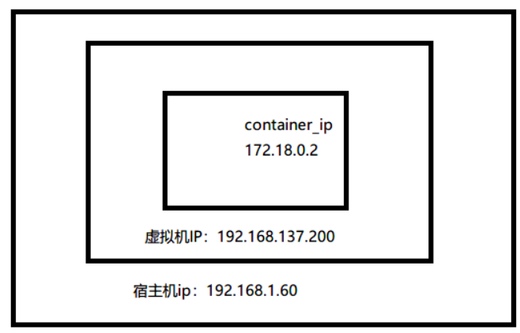

 

# 1.linux下载并安装minikube并启动

```shell
#1.创建非root用户
adduser test
passwd  test
#创建docker组
sudo groupadd docker
#将您的用户添加到该docker组
sudo usermod -aG docker test
#在Linux上，运行以下命令来激活对组的更改
newgrp docker
#2.安装docker
curl -fsSL https://get.docker.com | bash -s docker --mirror aliyun
#3.安装kubectl
curl -LO https://storage.googleapis.com/kubernetes-release/release/$(curl -s https://storage.googleapis.com/kubernetes-release/release/stable.txt)/bin/linux/amd64/kubectl
sudo chmod a+x ./kubectl
sudo mv ./kubectl /usr/local/bin/kubectl
#4.安装minikube
curl -Lo minikube https://kubernetes.oss-cn-hangzhou.aliyuncs.com/minikube/releases/v1.20.0/minikube-linux-amd64 && chmod +x minikube && sudo mv minikube /usr/local/bin/
#5.多节点启动
##创建主集群(默认Profile为minikube,可以加 -p 创建不通的k8s集群)
minikube start --force
##增加节点
minikube node add
##查看节点
minikube node list
##启动主节点仪表盘
minikube dashboard
##删除集群
minikube delete
```

# 2.开启Kubernetes试验田



## 2.1 物理机访问虚拟机内部的容器

```shell
#虚拟机开启路由转发
echo "net.ipv4.ip_forward=1" >> /etc/sysctl.conf
#物理机 win10 路由表加入
route add 172.18.0.0 mask 255.255.255.0 192.168.137.200

```

